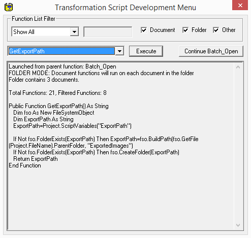
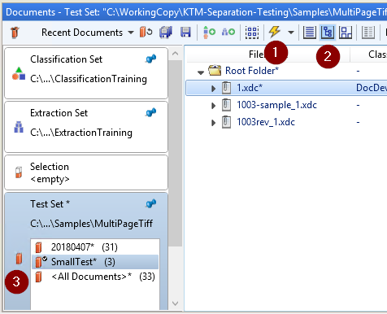

# Transformation Script Development Menu

Dynamic menu for use in KTM Project Builder and KTA Transformation Designer to allow for easy execution of design time scripts that work on individual documents, whole folders, or have no required parameters.  It will dynamically list all applicable project script functions which can then be filtered by name or type.  



## tl;dr

* KTM: Open a test set in hierarchy mode and test the Batch_Open event to open the menu to run folder functions.
* KTM/KTA: Extract a document as the class DocDevMenu to open the menu to run document functions.

## Folder Mode vs Document Mode

It is important to understand that Project Builder does not directly provide a way to run arbitrary script.  We use existing events to launch the menu, which is easy to do, but requires a bit of explanation.  It should be invoked from a folder level event for functions that need a folder parameter, a document level event for functions that need a parameter, or either for functions that do not need either.

### Providing an XFolder as a parameter (KTM Only)

Call DevMenu_Dialog from a folder level event such as Batch_Open, Batch_Close, or Application_InitializeBatch.  None of these events exist in a KTA Transformation project, so this approach is for KTM only.  If executing a document function (first parameter is an CscXDocument) when a folder parameter is provided, it will be run on each doc in the folder.

``` vb
Private Sub Batch_Open(ByVal pXRootFolder As CASCADELib.CscXFolder)
   ' Invoke DevMenu by testing the Batch_Open function (lightning bolt)
   ' This menu will only open when executed at design time, so it can be left in a project.
   DevMenu_Dialog(pXRootFolder)
   ' When closing the menu, script execution will end unless clicking the "Continue
   ' [Parent Event]" button, thus retaining the ability to test this event only when intended.
End Sub
```

Execute the event from the Runtime Script Events button with the lightning bolt icon (#1), or Ctrl + F11.  The product has some caveats about being able to use the Runtime Script Events button:  The test set must be in Hierarchy Mode (#2), and Hierarchy Mode can only be enabled in the default subset which is noted with a small checkmark (#3).



### Providing an XDocument as a parameter (KTM/KTA)

Call DevMenu_Dialog from a document level event such as Document_BeforeExtract.  It is recommended to create a class specifically for invoking the menu (uncheck "Valid classification result" and "Available for manual classification" so users do not see it).  With this class selected in the Project Tree on the left and a document selected in the test set, Right click on the docuemnt and select Extract (or F7) to invoke the menu.

``` vb
Private Sub Document_BeforeExtract(ByVal pXDoc As CASCADELib.CscXDocument)
   ' Invoke DevMenu by selecting the class, selecting the document, then extracting the document.
   DevMenu_Dialog(Nothing, pXDoc)
End Sub
```

#### Parent Folder

If executing a folder function (first paremeter is an CscXFolder), it will be run on the doc's parent folder, however this will not change the fact that structural changes cannot be made from a document event.  So while this approach can be used to run a function that reads from all documents in the folder, it cannot be used to do tasks like merge documents.

The reason this limitation is notable is that KTA TD lacks the batch level events to provide a folder directly, so this is the only way to run functions that require a folder.  Thus, functions that make structural changes, like [KTM Separation Testing](https://github.com/smklancher/KTM-Separation-Testing), cannot be used in KTA TD.

## Implementation Details

* ParseScript function parses the provided script into metadata that could be useful for doing other interesting things.
* IsDesignMode can be used to determine if Application/Batch events are running in the designer or runtime.  The product provided property, Project.ScriptExecutionMode, treats these events as always executing at runtime.
* If stripped to the case statement and Debug.Print statements, DevMenu_DialogFunc provides a good starting place for bulding a WinWrap Dialog and troubleshooting events.
* DevMenu_Execute uses Eval to get a delegate of an arbitrary function.
* DynamicInvoke takes delegate as a variant and a param array, then invokes the delegate with however many parameters are provided.
* Between ParseScript, DevMenu_Execute, and DynamicInvoke, this allows for behavior similar to reflection, which is how DevMenu can execute any function from it's own script dynamically.
* TestScriptFunctions reconstructs the method signatures from metadata for sake of testing.  Thus it can also be used to list all the functions in the script.
